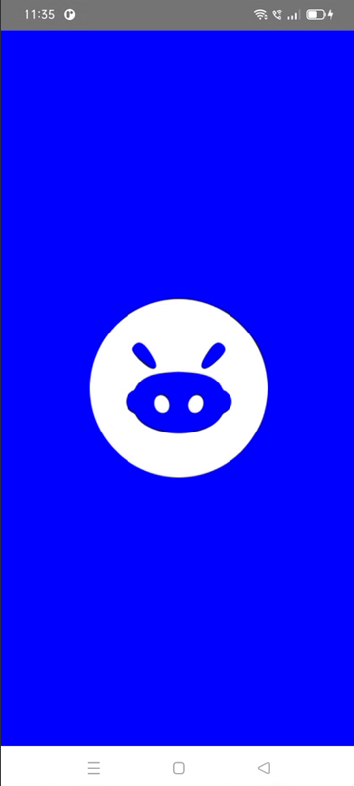
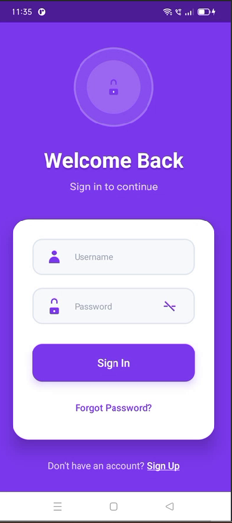
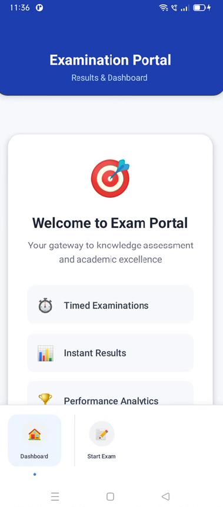
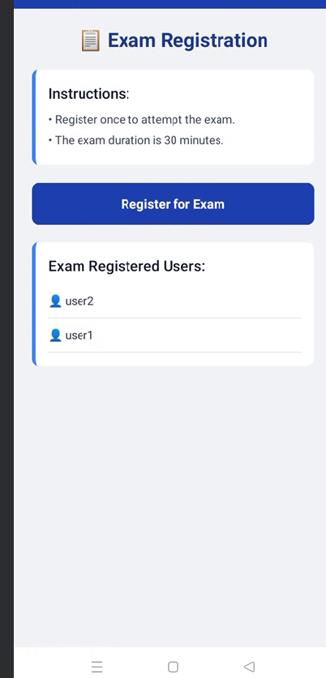
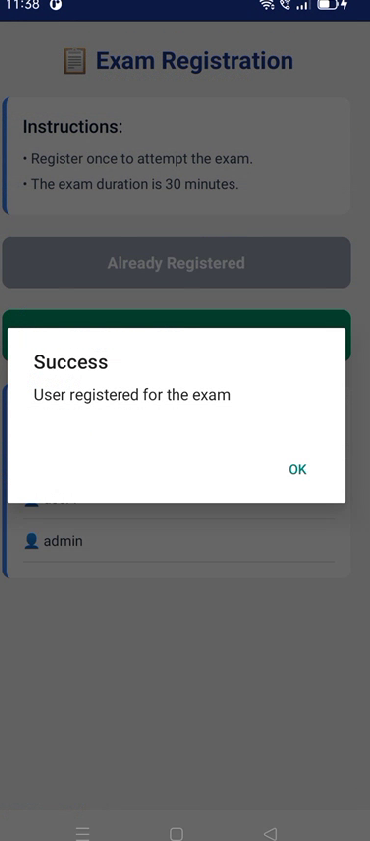
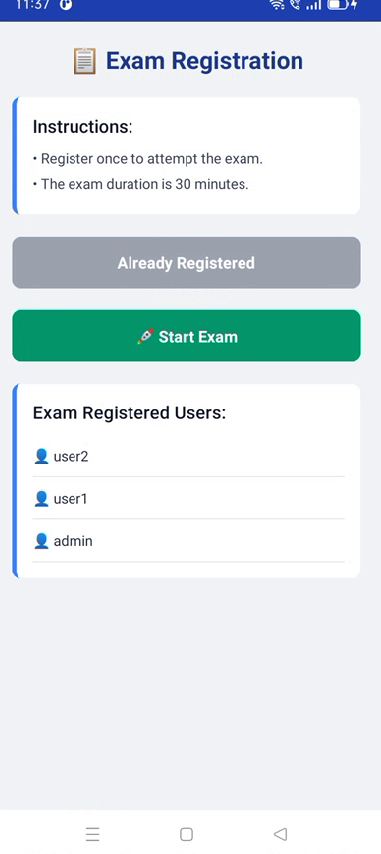
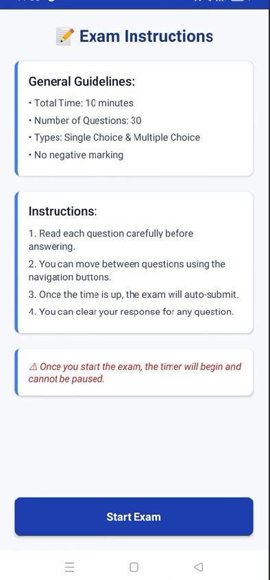
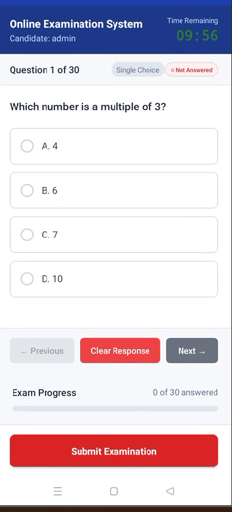
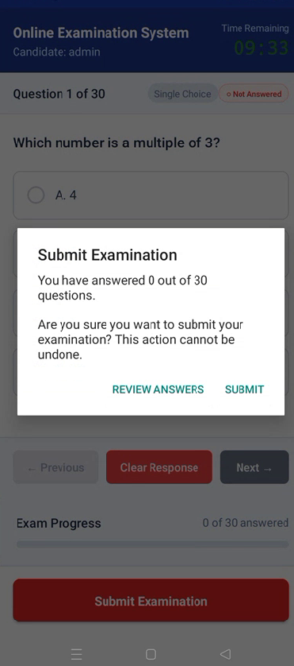
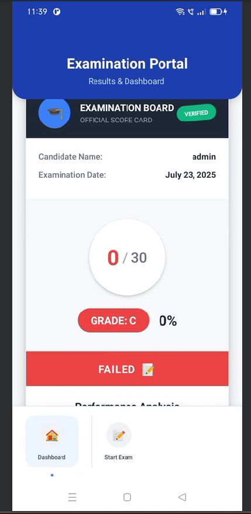

It is Online Exam System.In this System used somne technologies like:-
Backend:- 1.Flask for api's 
          2.MongoDB for Database
Frontend:-React Native

Some UI pictures:-

after click on Start exam button on Bottom navigation bar:-

in click start button:-

exam screen:-

result card:-

